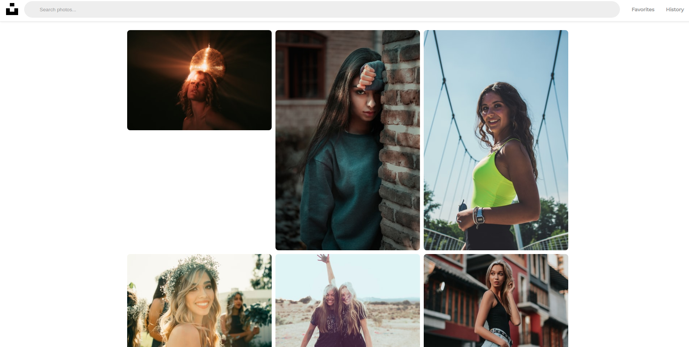
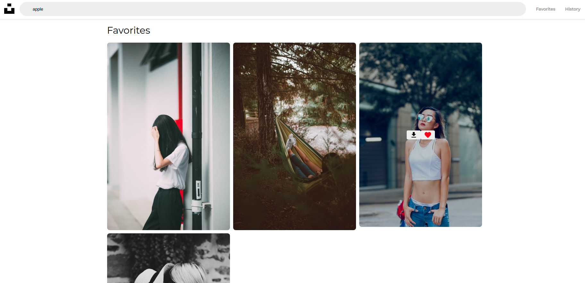
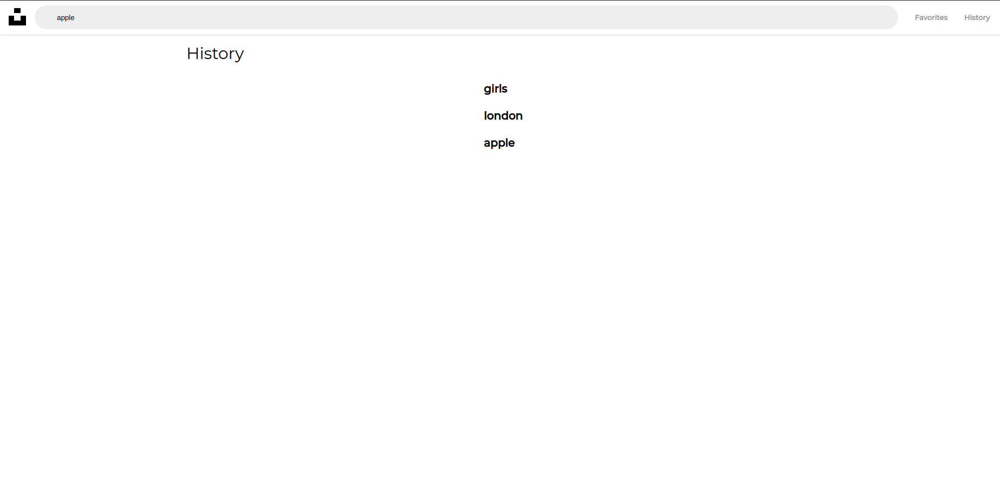

## Unsplash Clone

**Сделано:**

- Главная страница с рандомными фотографиями
- Поиск
- История поиска
- Страница избранных фотографий
- Сохранение данных при refresh
- Бесконечная прокрутка

**Доделать:**

- Верстку(+адаптив)
- Сохранение фотографии
- Toggle избранных

##### В качестве фреймворков использованы React и Redux.

**Скрины:**

Главная страница

Избранные

История

